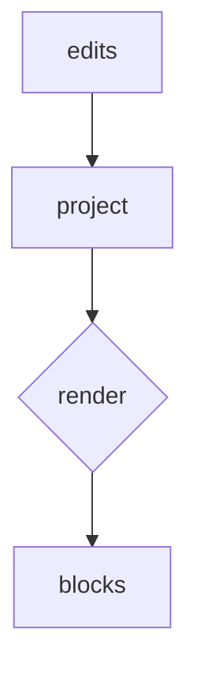

# Kitchen sink

A paragraph with **bold**, *italic*, ~~strikethrough~~, `inline code`, and a [link](https://github.com). Bare URLs auto-link: https://github.github.com/gfm/.

Crosslinks open in place (cmd-click): [partner doc](./sink-partner.md), [partner section](./sink-partner.md#second-part). Nowhere: [missing](./nope.md).

## Lists

- bullet
- still a bullet
  - nested bullet
    - deeper bullet

1. one
2. two
  1. nested ordered

- [ ] open task
  - [x] done task
    - [ ] deep task

## Quote

> A plain block quote.

> [!TIP]
> Massive!

> [!IMPORTANT]
> GitHub-style important.

> [!WARNING]
> GitHub-style warning.

> [!CAUTION]
> GitHub-style caution.

## Code

```rust
fn main() {
    println!("hello from crabmd");
}
```


```json
{ "crab": "md", "wrap": true }
```





## Tables

| Feature | GFM |
| --- | --- |
| Tables | yes |
| Task lists | yes |
| Alerts | yes |

## Media

Remote image renders as a card (never downloaded):


GitHub-style video (`<video src=…>`, extension optional):

<video src="https://github.com/solidjs-community/solid-primitives/assets/38070918/7c4fa01f-7959-4a67-9588-e28448f7f20d"></video>

Local video placeholder (drop an mp4 beside this file):


/

/

HTML image block (width passthrough renders the file when local):

<p>
  
</p>

---

# Second heading level one

Some trailing text after the rule.


/heading